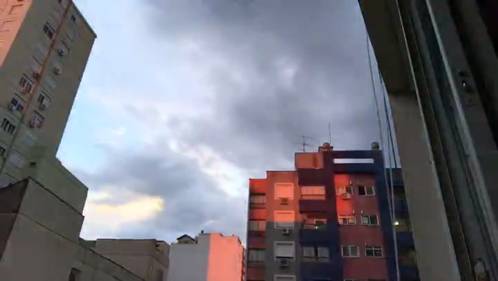

# Video Pipeline (frame → filter → shuffle → video)

ADD THIS: Things that could make it run faster: 
1 - Extracting and resizing/cropping images during the same pass
2 - Concurrent processes at steps 1, 2, 3

A small, reproducible pipeline that turns one or more input videos into a new video by extracting frames, normalizing them (resize), removing frames that contain text (OCR), shuffling the remainder, and rendering a final video.

It was built to automate a messy real-world workflow. The version in this repo is the simplified, end-to-end automatic variant: it produces a final output without manual review steps.

---

## Examples

### Input (still frames from source videos)

  

 


### Output (≤ 5s animated preview)


---

## Workflow

**Supported / tested:** Docker (macOS/Windows/Linux via Docker Desktop)  
**Also works:** Native macOS + Linux (ffmpeg + ffprobe + Python deps installed)  
**Not targeted:** Native Windows without WSL

1. Extract frames from input videos (`steps/1-extract_frames.sh`)
2. Crop/resize frames to a consistent format (`steps/2-resize_images.sh`)
3. Detect and delete frames containing text (OCR) (`steps/3-delete_text.py`)
4. Randomize the order of remaining frames (`steps/4-randomize_order.sh`)
5. Convert frames back to video (`steps/5-convert_frames_to_video.sh`)

---

## Quick start (Docker)

1) Put videos in `samples/videos/` (some are already there).

2) Run:

```bash
make
# or:
bash run.sh
```

The final output is written to `output/`.

Cleaning generated files:

```bash
make clean
```

---

## Quick start (native macOS / Linux)

Requirements:
- `ffmpeg` and `ffprobe`
- Python 3 + dependencies from `requirements.txt`
- Tesseract OCR (used by `steps/3-delete_text.py`)

Example (roughly):

```bash
python3 -m venv .venv
source .venv/bin/activate
pip install -r requirements.txt

bash run.sh
```

---

## Configuration

The main entrypoint is `run.sh`. It typically exports variables and paths used by the `steps/*` scripts.

Common knobs you might want to expose (names may differ in your scripts):
- input directory (default: `samples/videos`)
- working directory (temporary frames)
- output file name
- FPS used for the final render
- OCR sensitivity / confidence threshold in `steps/3-delete_text.py`

## Project structure

```txt
.
├── Dockerfile
├── Makefile
├── README
├── docker-compose.yml
├── docs
│   └── media
│       └── empty.txt
├── output
├── requirements.txt
├── run.sh
├── samples
│   ├── README.md
│   └── videos
│       ├── TO DO
│       ├── TO DO
│       └── TO DO
├── steps
│   ├── 1-extract_frames.sh
│   ├── 2-resize_images.sh
│   ├── 3-delete_text.py
│   ├── 4-randomize_order.sh
│   └── 5-convert_frames_to_video.sh
└── vp-run-portable.sh
```

What each top-level file does:
- `run.sh`: main runner that orchestrates the pipeline
- `vp-run-portable.sh`: alternative entrypoint for portability (if you prefer a single script)
- `steps/*`: pipeline steps (Bash + Python)
- `samples/`: sample videos to test the pipeline quickly
- `docs/media/`: images/GIFs used by this README
- `output/`: final rendered output(s)

---

## Troubleshooting

If OCR deletes too many frames (false positives):
- Make the OCR threshold stricter in `steps/3-delete_text.py`
- Require longer words / more letters before counting it as “text”
- Restrict OCR to specific regions (subtitles often sit at the bottom)

If OCR misses text (false negatives):
- Lower the confidence threshold
- Increase preprocessing (contrast/thresholding) before OCR
- Try a stricter “word-like” rule (e.g., 3+ letters) but accept that logos can be tricky

If Docker builds but the pipeline fails:
- Make sure input videos are mounted/visible inside the container
- Confirm `ffmpeg` and `tesseract` are installed in the container image
- Check paths in `run.sh` (relative paths are the #1 cause)

---

## Notes / limitations

- This is a destructive filter: frames detected as containing text are removed.
- Results depend heavily on footage: subtitles, logos, and tiny text are harder.
- OCR settings are a trade-off between false positives and false negatives.

---

## License
MIT license 2025-2026